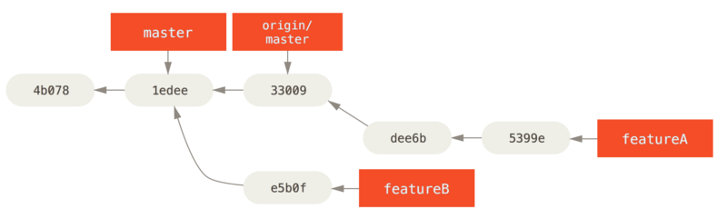
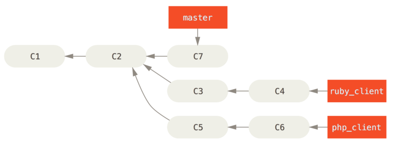

# 5. 분산 환경에서의 Git

앞 장에서 다른 개발자와 코드를 공유하는 리모트 저장소를 만드는 법을 배웠다. 로컬에서 작업하는 데 필요한 기본적인 명령어에는 어느 정도 익숙해졌다. 이제는 분산 환경에서 Git이 제공하는 기능을 어떻게 효율적으로 사용할지를 배운다.

이번 장에서는 분산 환경에서 Git을 어떻게 사용할 수 있을지 살펴본다. 프로젝트 기여자 입장과 여러 수정사항을 취합하는 관리자 입장에서 두루 살펴본다. 즉, **프로젝트 기여자 또는 관리자로서 작업물을 프로젝트에 어떻게 포함시킬지와 수 많은 개발자가 수행한 일을 취합하고 프로젝트를 운영하는 방법을 배운다.**


## 5.1 분산 환경에서의 워크플로

중앙집중형 버전 관리 시스템과는 달리 **Git은 분산형**이다. Git은 구조가 매우 유연하기 때문에 여러 개발자가 함께 작업하는 방식을 더 다양하게 구성할 수 있다. 중앙집중형 버전 관리 시스템에서 각 개발자는 중앙 저장소를 중심으로 하는 한 노드일 뿐이다. 하지만, Git에서는 각 개발자의 저장소가 하나의 노드이기도 하고 중앙 저장소 같은 역할도 할 수 있다. 즉, 모든 개발자는 다른 개발자의 저장소에 일한 내용을 전송하거나, 다른 개발자들이 참여할 수 있도록 자신이 운영하는 저장소 위치를 공개할 수도 있다. 이런 특징은 프로젝트나 팀이 코드를 운영할 때 다양한 워크플로를 만들 수 있도록 해준다. 이런 유연성을 살려 저장소를 운영하는 몇 가지 방식을 소개한다. 각 방식의 장단점을 살펴보고 그 방식 중 하나를 고르거나 여러 가지를 적절히 섞어 쓰면 된다.


### 중앙집중식 워크플로

중앙집중식 시스템에서는 보통 중앙집중식 협업 모델이라는 한 가지 방식밖에 없다. **중앙 저장소는 딱 하나 있고 변경 사항은 모두 이 중앙 저장소에 집중된다.** 개발자는 이 중앙 저장소를 중심으로 작업한다


그림 54. 중앙집중식 워크플로.


중앙집중식에서 개발자 두 명이 중앙저장소를 Clone 하고 각자 수정하는 상황을 생각해보자. 

1. 한 개발자가 자신이 한 일을 커밋하고 나서 아무 문제 없이 서버에 Push 한다. 
2. 다른 개발자는 자신의 일을 커밋하고 Push 하기 전에 첫 번째 개발자가 한 일을 먼저 Merge 해야 한다. Merge를 해야 첫 번째 개발자가 작업한 내용을 덮어쓰지 않는다. 

이런 개념은 Subversion과 같은 중앙집중식 버전 관리 시스템에서 사용하는 방식이고 Git에서도 당연히 이런 워크플로를 사용할 수 있다.

팀이 작거나 이미 중앙집중식에 적응한 상황이라면 이 워크플로에 따라 Git을 도입하여 사용할 수 있다. 중앙 저장소를 하나 만들고 개발자 모두에게 Push 권한을 부여한다. 모두에게 Push 권한을 부여해도 Git은 한 개발자가 다른 개발자의 작업 내용을 덮어쓰도록 허용하지 않는다.

John과 Jessica가 동시에 같은 부분을 수정하는 상황을 생각해보자. 

1. John이 먼저 작업을 끝내고 수정한 내용을 서버로 Push 한다.
2. Jessica도 마찬가지로 작업을 끝내고 수정한 내용을 서버로 Push 하려 하지만 서버가 바로 받아주지 않는다. 

서버에는 John이 수정한 내용이 추가되었기 때문에 Push 하기 전에 Fetch로 받아서 Merge 한 후 Push 할 수 있다. 이런 개념은 개발자에게 익숙해서 거부감 없이 도입할 수 있다.

작은 팀만 이렇게 일할 수 있는 것이 아니다. Git이 제공하는 브랜치 관리 모델을 사용하면 수백명의 개발자가 한 프로젝트 안에서 다양한 브랜치를 만들어서 함께 작업하는 것도 쉽다.

> 🧑‍💻 실습
>
> 위의 상황에 대해 스터디 때 실습해보자.


### Integration-Manager 워크플로

Git을 사용하면 리모트 저장소를 여러 개 운영할 수 있다. 다른 개발자는 읽기만 가능하고 자신은 쓰기도 가능한 공개 저장소를 만드는 워크플로도 된다. 이 Workflow에는 보통 프로젝트를 대표하는 공식 저장소가 있다. 기여자는 우선 공식 저장소를 하나 Clone 하고 수정하고 나서 자신의 저장소에 Push 한다. 그 다음에 프로젝트 Integration-Manager에게 새 저장소에서 Pull 하라고 요청한다. 그러면 그 Integration-Manager는 기여자의 저장소를 리모트 저장소로 등록하고, 로컬에서 기여물을 테스트하고, 프로젝트 메인 브랜치에 Merge 하고, 그 내용을 다시 프로젝트 메인 저장소에 Push 한다. 이런 과정은 아래와 같다([Integration-manager workflow.](https://git-scm.com/book/ko/v2/ch00/wfdiag_b)).

1. 프로젝트 Integration-Manager는 프로젝트 메인 저장소에 Push를 한다.
2. 프로젝트 기여자는 메인 저장소를 Clone 하고 수정한다.
3. 기여자는 자신의 저장소에 Push 하고 Integration-Manager가 접근할 수 있도록 공개해 놓는다.
4. 기여자는 Integration-Manager에게 변경사항을 적용해 줄 것을 이메일로 요청한다.
5. Integration-Manager는 기여자의 저장소를 리모트 저장소로 등록하고 수정사항을 Merge 하여 테스트한다.
6. Integration-Manager는 Merge 한 사항을 메인 저장소에 Push 한다.


그림 55. Integration-manager workflow.

이 방식은 GitHub나 GitLab 같은 Hub 사이트를 통해 주로 사용하는 방식이다. 프로젝트를 Fork 하고 수정사항을 반영하여 다시 모두에게 공개하기 좋은 구조로 돼 있다. 이 방식의 장점은 기여자와 Integration-Manager가 각자의 사정에 맞춰 프로젝트를 유지할 수 있다는 점이다. 기여자는 자신의 저장소와 브랜치에서 수정 작업을 계속해 나갈 수 있고 수정사항이 프로젝트에 반영되도록 기다릴 필요가 없다. 관리자는 여유를 가지고 기여자가 Push 해 놓은 커밋을 적절한 시점에 Merge 한다.


### Dictator and Lieutenants 워크플로

이 방식은 저장소를 여러개 운영하는 방식을 변형한 구조이다. 보통 수백 명의 개발자가 참여하는 아주 큰 프로젝트를 운영할 때 이 방식을 사용한다. Linux 커널 프로젝트가 대표적이다. 여러 명의 Integration-Manager가 저장소에서 자신이 맡은 부분만을 담당하는데 이들을 *Lieutenants* 라고 부른다. 모든 Lieutenant는 최종 관리자 아래에 있으며 이 최종 관리자를 *Benevolent Dictator* 라고 부른다. Benevolent Dictator는 Lieutenant의 저장소를 가져와 공식 저장소에 Push 하고 모든 프로젝트 참여자는 이 공식 저장소에서 반드시 Pull 해야 한다. 이러한 워크플로는 아래와 같다([Benevolent dictator workflow.](https://git-scm.com/book/ko/v2/ch00/wfdiag_c)).

1. 개발자는 코드를 수정하고 `master` 브랜치를 기준으로 자신의 토픽 브랜치를 Rebase 한다. 여기서 `master` 브랜치란 공식 저장소의 브랜치를 말한다.
2. Lieutenant들은 개발자들의 수정사항을 자신이 관리하는 `master` 브랜치에 Merge 한다.
3. Dictator는 Lieutenant의 `master` 브랜치를 자신의 `master` 브랜치로 Merge 한다.
4. Dictator는 자신의 `master` 브랜치를 Push 하며 다른 모든 개발자는 Dictator의 `master` 브랜치를 기준으로 Rebase 한다.


그림 56. Benevolent dictator workflow.

이 방식이 일반적이지 않지만 깊은 계층 구조를 가지는 환경이나 규모가 큰 프로젝트에서는 매우 쓸모 있다. 프로젝트 리더가 모든 코드를 통합하기 전에 코드를 부분부분 통합하도록 여러 명의 Lieutenant에게 위임한다.


### 워크플로 요약

이 세 가지 워크플로가 Git 같은 분산 버전 관리 시스템에서 주로 사용하는 것들이다. 사실 이런 워크플로뿐만 아니라 다양한 변종 워크플로가 실제로 사용된다. 어떤 방식을 선택하고 혹은 조합해야 하는 지 살짝 감이 잡힐 것이다. 앞으로 몇 가지 구체적 사례를 들고 우리가 다양한 환경에서 각 역할을 어떻게 수행하는지 살펴본다. 이어지는 내용에서 프로젝트에 참여하고 기여할 때 작업 패턴이 어떠한지 몇 가지 살펴보기로 한다.


## 5.2 프로젝트에 기여하기

프로젝트에 기여하는 방식을 설명하는데 가장 어려운 점은 그 방식이 매우 다양하다는 점이다. 

Git이 워낙 유연하게 설계됐기 때문에 사람들은 여러 가지 방식으로 사용할 수 있다. 게다가 프로젝트마다 환경이 달라서 프로젝트에 기여하는 방식을 쉽게 설명하기란 정말 어렵다. 기여하는 방식에 영향을 끼치는 몇 가지 변수가 있다. 활발히 기여하는 개발자의 수가 얼마인지, 선택한 워크플로가 무엇인지, 각 개발자에게 접근 권한을 어떻게 부여했는지, 외부에서도 기여할 수 있는지 등이 변수다.

첫 번째로 살펴볼 변수는 활발히 활동하는 개발자의 수이다. 

얼마나 많은 개발자가 얼마나 자주 코드를 쏟아 내는가 하는 점이 활발한 개발자의 기준이다. 대부분 둘, 셋 정도의 개발자가 하루에 몇 번 커밋을 하고 활발하지 않은 프로젝트는 더 띄엄띄엄할 것이다. 하지만, 아주 큰 프로젝트는 수백, 수천 명의 개발자가 하루에도 수십, 수백 개의 커밋을 만들어 낸다. 개발자가 많으면 많을수록 코드를 깔끔하게 적용하거나 Merge 하기 어려워진다. 어떤 커밋은 다른 개발자가 이미 기여한 것으로 불필요해지기도 하고 때론 서로 충돌이 일어난다. 어떻게 해야 코드를 최신으로 유지하면서 원하는 대로 수정할 수 있을까?

두 번째 변수는 프로젝트에서 선택한 워크플로다. 

개발자 모두가 메인 저장소에 쓰기 권한을 갖는 중앙집중형 방식인가? 프로젝트에 모든 Patch를 검사하고 통합하는 관리자가 따로 있는가? 모든 수정사항을 개발자끼리 검토하고 승인하는가? 자신이 그저 돕는게 아니라 어떤 책임을 맡고 있는지? 중간 관리자가 있어서 그들에게 먼저 알려야 하는가?

세 번째 변수는 접근 권한이다. 

'프로젝트에 쓰기 권한이 있어서 직접 쓸 수 있는가? 아니면 읽기만 가능한가?'에 따라서 프로젝트에 기여하는 방식이 매우 달라진다. 쓰기 권한이 없다면 어떻게 수정 사항을 프로젝트에 반영할 수 있을까? 수정사항을 적용하는 정책이 프로젝트에 있는가? 얼마나 많은 시간을 프로젝트에 할애하는가? 얼마나 자주 기여하는가?

이런 질문에 따라 프로젝트에 기여하는 방법과 워크플로가 달라진다. 간단한 것부터 복잡한 것까지 예제를 통해 각 상황을 살펴보면 실제 프로젝트에 필요한 워크플로를 선택하는 데 도움이 될 것이다.


### 커밋 가이드라인

다른 것보다 먼저 커밋 메시지에 대한 주의사항을 알아보자. 

커밋 메시지를 잘 작성하는 가이드라인을 알아두면 다른 개발자와 함께 일하는 데 도움이 많이 된다. Git 프로젝트에 보면 커밋 메시지를 작성하는데 참고할 만한 좋은 팁이 많다. Git 프로젝트의 `Documentation/SubmittingPatches` 문서를 참고하자.

무엇보다도 먼저 공백문자를 깨끗하게 정리하고 커밋해야 한다. Git은 공백문자를 검사해볼 수 있는 간단한 명령을 제공한다. 커밋을 하기 전에 `git diff --check` 명령으로 공백문자에 대한 오류를 확인할 수 있다.


그림 57. `git diff --check` 의 결과.


커밋을 하기 전에 공백문자에 대해 검사를 하면 공백으로 불필요하게 커밋되는 것을 막고 이런 커밋으로 인해 불필요하게 다른 개발자들이 신경 쓰는 일을 방지할 수 있다.

그리고 각 커밋은 논리적으로 구분되는 Changeset이다. **최대한 수정사항을 한 주제로 요약할 수 있어야 하고 여러 가지 이슈에 대한 수정사항을 하나의 커밋에 담지 않아야 한다.** **여러 가지 이슈를 한꺼번에 수정했다고 하더라도 Staging Area를 이용하여 한 커밋에 이슈 하나만 담기도록 한다.** 작업 내용을 분할하고, 각 커밋마다 적절한 메시지를 작성한다. 같은 파일의 다른 부분을 수정하는 경우에는 `git add -patch` 명령을 써서 한 부분씩 나누어 Staging Area에 저장해야 한다(관련 내용은 [대화형 명령](https://git-scm.com/book/ko/v2/ch00/_interactive_staging) 에서 다룬다). 결과적으로 최종 프로젝트의 모습은 한 번에 커밋을 하든 다섯 번에 나누어 커밋을 하든 똑같다.

하지만, 여러 번 나누어 커밋하는 것이 다른 동료가 수정한 부분을 확인할 때나 각 커밋의 시점으로 복원해서 검토할 때 이해하기 훨씬 쉽다. [히스토리 단장하기](https://git-scm.com/book/ko/v2/ch00/_rewriting_history) 에서 이미 저장된 커밋을 다시 수정하거나 파일을 단계적으로 Staging Area에 저장하는 방법을 살펴본다. **다양한 도구를 이용해서 간단하고 이해하기 쉬운 커밋을 쌓아가야 한다.**

마지막으로 명심해야 할 점은 커밋 메시지 자체다. 좋은 커밋 메시지를 작성하는 습관은 Git을 사용하는 데 도움이 많이 된다. 일반적으로 커밋 메시지를 작성할 때 사용하는 규칙이 있다. 메시지의 첫 라인에 50자가 넘지 않는 아주 간략한 메시지를 적어 해당 커밋을 요약한다. 다음 한 라인은 비우고 그다음 라인부터 커밋을 자세히 설명한다. 예를 들어 Git 개발 프로젝트에서는 개발 동기와 구현 상황의 제약 조건이나 상황 등을 자세하게 요구한다. 이런 점은 따를 만한 좋은 가이드라인이다. 그리고 현재형 표현을 사용하는 것이 좋다. 명령문으로 시작하는 것도 좋은 방법이다. 예를 들어 `I added tests for (테스트를 추가함)` 보다는 `Add tests for (테스트 추가)` 와 같은 메시지를 작성한다. 아래 내용은 [Tim Pope가 작성한 커밋 메시지의 템플릿](http://tbaggery.com/2008/04/19/a-note-about-git-commit-messages.html)이다.

```sh
영문 50글자 이하의 간략한 수정 요약

자세한 설명. 영문 72글자 이상이 되면
라인 바꿈을 하고 이어지는 내용을 작성한다.
특정 상황에서는 첫 번째 라인이 이메일
메시지의 제목이 되고 나머지는 메일
내용이 된다. 빈 라인은 본문과 요약을
구별해주기에 중요하다(본문 전체를 생략하지 않는 한).

이어지는 내용도 한 라인 띄우고 쓴다.

  - 목록 표시도 사용할 수 있다.

  - 보통 '-' 나 '*' 표시를 사용해서 목록을 표현하고
    표시 앞에 공백 하나, 각 목록 사이에는 빈 라인
    하나를 넣는데, 이건 상황에 따라 다르다.
```

메시지를 이렇게 작성하면 함께 일하는 사람은 물론이고 자신에게도 매우 유용하다. Git 개발 프로젝트에는 잘 쓰인 커밋 메시지가 많으므로 프로젝트를 내려받아서 `git log --no-merges` 명령으로 꼭 살펴보기를 권한다.

> ⚠️ 주의
>
> 책 처럼 하지말고, 시키는 대로 하기.시간 관계상, 이 책에서 설명하는 예제의 커밋 메시지는 위와 같이 아주 멋지게 쓰지 않았다. `git commit` 명령에서 `-m` 옵션을 사용하여 간단하게 적는다.하지만! 저자처럼 하지 말고 시키는 대로 하는 것이 좋다.


### 비공개 소규모 팀

두세 명으로 이루어진 비공개 프로젝트가 가장 간단한 프로젝트일 것이다. `비공개` 라고 함은 소스코드가 공개되지 않은 것을 말하는 것이지 외부에서 접근할 수 없는 것을 말하지 않는다. 모든 개발자는 공유하는 저장소에 쓰기 권한이 있어야 한다.

이런 환경에서는 보통 Subversion 같은 중앙집중형 버전 관리 시스템에서 사용하던 방식을 사용한다. 물론 Git이 가진 오프라인 커밋 기능이나 브랜치 Merge 기능을 이용하긴 하지만 크게 다르지 않다. **가장 큰 차이점은 서버가 아닌 클라이언트 쪽에서 Merge 한다는 점이다.** 

두 개발자가 저장소를 공유하는 시나리오를 살펴보자. 개발자인 John은 저장소를 Clone 하고 파일을 수정하고 나서 로컬에 커밋한다 (예제에서 Git이 출력하는 메시지 중 일부는 `…`으로 줄이고 생략했다).

```sh
# John's Machine
$ git clone john@githost:simplegit.git
Cloning into 'simplegit'...
...
$ cd simplegit/
$ vim lib/simplegit.rb
$ git commit -am 'remove invalid default value'
[master 738ee87] remove invalid default value
 1 files changed, 1 insertions(+), 1 deletions(-)
```


개발자인 Jessica도 저장소를 Clone 하고 나서 파일을 하나 새로 추가하고 커밋한다.

```sh
# Jessica's Machine
$ git clone jessica@githost:simplegit.git
Cloning into 'simplegit'...
...
$ cd simplegit/
$ vim TODO
$ git commit -am 'add reset task'
[master fbff5bc] add reset task
 1 files changed, 1 insertions(+), 0 deletions(-)
```


Jessica는 서버에 커밋을 Push 한다.

```sh
# Jessica's Machine
$ git push origin master
...
To jessica@githost:simplegit.git
   1edee6b..fbff5bc  master -> master
```

Push 명령을 실행하고 난 결과 중 가장 마지막 줄은 유용한 정보를 보여주고 있다. 마지막 줄의 기본적인 형태는 `<oldref>..<newref> fromref → toref` 이다. `oldref`는 이전 레퍼런스를, `newref`는 새 레퍼런스를, `fromref`는 Push 명령에서 사용한 로컬 레퍼런스의 이름을, `toref`는 Push로 업데이트한 리모트 레퍼런스를 나타낸다. 이어지는 내용에서 지금과 비슷한 Push 명령 출력 결과는 여러번 등장한다. 이 출력 메시지의 내용을 이해하고 있으면 다양한 상태에서 정확하게 어떤일이 벌어지는가를 좀 더 쉽게 이해할 수 있다. 자세한 내용을 좀 더 살펴보려면 Git 문서 [git-push](https://git-scm.com/docs/git-push)를 참고한다.

다시 예제 내용으로 돌아오면, John도 내용을 변경하고 커밋을 만든 후 서버로 커밋을 Push 하려고 한다.

```sh
# John's Machine
$ git push origin master
To john@githost:simplegit.git
 ! [rejected]        master -> master (non-fast forward)
error: failed to push some refs to 'john@githost:simplegit.git'
```

Jessica의 Push한 내용으로 인해, John의 커밋은 서버에서 거절된다. 

Subversion을 사용했던 사람은 이 부분을 이해하는 것이 중요하다. 같은 파일을 수정한 것도 아닌데 왜 Push가 거절되는 걸까? Subversion에서는 서로 다른 파일을 수정하는 이런 Merge 작업은 자동으로 서버가 처리한다. 하지만 Git은 로컬에서 먼저 *Merge* 해야 한다. 다시 말해 John은 Push 하기 전에 Jessica가 수정한 커밋을 Fetch 하고 Merge 해야 한다는 말이다.

이를 위해 우선 John은 Jessica의 작업 내용을 아래와 같이 Fetch 한다(아래 명령은 Jessica의 작업 내용을 내려받긴 하지만 Merge 까지 하지는 않는 작업이다).

```sh
$ git fetch origin
...
From john@githost:simplegit
 + 049d078...fbff5bc master     -> origin/master
```


Fetch 하고 나면 John의 로컬 저장소는 아래와 같이 된다.


그림 58. Fetch 하고 난 John의 저장소.

이제 John은 Fetch하여 가져 온 Jessica의 작업 내용을 Merge 할 수 있다.

```sh
$ git merge origin/master
Merge made by the 'recursive' strategy.
 TODO |    1 +
 1 files changed, 1 insertions(+), 0 deletions(-)
```


Merge가 잘 이루어지면 John의 브랜치는 아래와 같은 상태가 된다.


그림 59. `origin/master` 브랜치를 Merge 하고 난 후 John의 저장소.


John은 Merge 하고 나서 자신이 작업한 코드가 제대로 동작하는지 확인한다. 그 후에 공유하는 저장소에 Push 한다.

```sh
$ git push origin master
...
To john@githost:simplegit.git
   fbff5bc..72bbc59  master -> master
```


이제 John의 저장소는 아래와 같이 되었다.


그림 60. Push 하고 난 후 John의 저장소.


동시에 Jessica는 토픽 브랜치를 하나 만든다. issue54 브랜치를 만들고 세 번에 걸쳐서 커밋한다. 아직 John의 커밋을 Fetch 하지 않은 상황이기 때문에 아래와 같은 상황이 된다.


그림 61. Jessica의 토픽 브랜치.


Jessica는 John이 새로 Push했다는 것을 알게 되어 하던 작업을 멈추고 John의 작업 내용을 살펴보려고 한다. 하지만 아직 Jessica는 John의 변경사항을 가지고 있지 않은 상태이다.

```sh
# Jessica's Machine
$ git fetch origin
...
From jessica@githost:simplegit
   fbff5bc..72bbc59  master     -> origin/master
```

위 명령으로 John이 Push 한 커밋을 모두 내려받는다. 그러면 Jessica의 저장소는 아래와 같은 상태가 된다.


그림 62. John의 커밋을 Fetch 한 후 Jessica의 저장소.


이제 `orgin/master` 와 Merge 할 차례다. Jessica는 토픽 브랜치에서의 작업을 마치고 어떤 내용이 Merge 되는지 `git log` 명령으로 확인한다.

```sh
$ git log --no-merges issue54..origin/master
commit 738ee872852dfaa9d6634e0dea7a324040193016
Author: John Smith <jsmith@example.com>
Date:   Fri May 29 16:01:27 2009 -0700

   remove invalid default value
```


> ✏️ [범위로 커밋 가리키기](https://git-scm.com/book/ko/v2/ch00/_commit_ranges) (Double Dot)
>
> 
>
> 범위를 표현하는 문법으로 Double Dot(..)을 많이 쓴다. Double Dot은 어떤 커밋들이 한쪽에는 관련됐고 다른 쪽에는 관련되지 않았는지 Git에게 물어보는 것이다. 예들 들어 [범위를 설명하는 데 사용할 예제](https://git-scm.com/book/ko/v2/ch00/double_dot)과 같은 커밋 히스토리가 있다고 가정하자.
>
> 
>
> 그림 137. 범위를 설명하는 데 사용할 예제
>
> 
>
> `experiment` 브랜치의 커밋들 중에서 아직 master 브랜치에 Merge 하지 않은 것들만 보고 싶으면 `master..experiment` 라고 사용한다. 이 표현은 `master에는 없지만, experiment에는 있는 커밋` 을 의미한다. 여기에서는 설명을 쉽게 하려고 실제 조회 결과가 아니라 그림의 커밋을 의미하는 문자를 사용한다.
>
> ```sh
> $ git log master..experiment
> D
> C
> ```
>
> `experiment` 브랜치를 Merge 할 때마다 Merge 하기 전에 무엇이 변경됐는지 확인해보고 싶을 것이다. 그리고 리모트 저장소에 Push 할 때도 마찬가지로 차이점을 확인해보고 싶을 것이다. 이럴 때 굉장히 유용하다.
>
> 
>
> ```sh
> $ git log origin/master..HEAD
> ```
>
> 이 명령은 `origin` 저장소의 `master` 브랜치에는 없고 현재 Checkout 중인 브랜치에만 있는 커밋을 보여준다. Checkout 한 브랜치가 `origin/master` 라면 `git log origin/master..HEAD` 가 보여주는 커밋이 Push 하면 서버에 전송될 커밋들이다. 그리고 한쪽의 Refs를 생략하면 Git은 `HEAD`라고 가정하기 때문에 `git log origin/master..` 는 `git log origin/master..HEAD` 와 같다.


앞의 명령에 따라 히스토리를 검색한 결과 John이 생성하고 Jessica가 Merge 하지 않은 커밋을 하나 찾았다. `origin/master` 브랜치를 Merge 하게 되면 검색된 커밋 하나가 로컬 작업에 Merge 될 것이다.

Merge 할 내용을 확인한 Jessica는 자신이 작업한 내용과 John이 Push 한 작업(`origin/master`)을 `master` 브랜치에 Merge 하고 Push 한다.

`issue54` 토픽 브랜치에 쌓은 모든 내용을 합치려면, 우선 `master` 브랜치를 Checkout 해야 한다.

```sh
$ git checkout master
Switched to branch 'master'
Your branch is behind 'origin/master' by 2 commits, and can be fast-forwarded.
```

`origin/master`, `issue54` 모두 Upstream 브랜치이기 때문에 둘 중에 무엇을 먼저 Merge 하든 상관이 없다. 물론 어떤 것을 먼저 Merge 하느냐에 따라 히스토리 순서는 달라지지만, 최종 결과는 똑같다. Jessica는 먼저 `issue54` 브랜치를 Merge 한다.

```sh
$ git merge issue54
Updating fbff5bc..4af4298
Fast forward
 README           |    1 +
 lib/simplegit.rb |    6 +++++-
 2 files changed, 6 insertions(+), 1 deletions(-)
```

보다시피 Fast-forward Merge 이기 때문에 명령 실행 결과는 별 문제가 없다.

 `origin/master`에 쌓여있던 John의 작업 내용을 다음과 같이 실행하여 Jessica는 Merge 작업을 완료할 수 있다.

```sh
$ git merge origin/master
Auto-merging lib/simplegit.rb
Merge made by the 'recursive' strategy.
 lib/simplegit.rb |    2 +-
 1 files changed, 1 insertions(+), 1 deletions(-)
```

위와 같이 Merge가 잘 되면 그림 아래와 같은 상태가 된다.


그림 63. John의 커밋을 Merge 후 Jessica의 저장소.


`origin/master` 브랜치가 Jessica의 `master` 브랜치로 나아갈(reachable) 수 있기 때문에 Push는 성공한다(물론 John이 그 사이에 Push 하지 않았다면).

```sh
$ git push origin master
...
To jessica@githost:simplegit.git
   72bbc59..8059c15  master -> master
```


두 개발자의 커밋을 성공적으로 Merge 하고 나면 결과는 아래와 같다.


그림 64. Jessica가 서버로 Push 하고 난 후의 저장소.


매우 간단한 상황의 예제를 살펴보았다. 토픽 브랜치에서 수정하고 로컬의 `master` 브랜치에 Merge 한다. 작업한 내용을 프로젝트의 공유 저장소에 Push 하고자 할 때는 우선 `origin/master` 브랜치를 Fetch 하고 Merge 한다. 그리고 나서 Merge 한 결과를 다시 서버로 Push 한다. 이런 워크플로가 일반적이며 아래와 같이 나타낼 수 있다.


그림 65. 여러 개발자가 Git을 사용하는 워크플로.


### 비공개 대규모 팀

이제 비공개 대규모 팀에서의 역할을 살펴보자. 이런 상황에는 보통 팀을 여러 개로 나눈다. 그래서 각각의 작은 팀이 서로 어떻게 하나로 Merge 하는지를 살펴본다.

John과 Jessica는 `featureA` 기능을 함께 작업하게 됐다. Jessica는 Josie와 함께 `featureB` 기능도 작업하고 있다. 이런 상황이라면 회사는 Integration-manager 워크플로를 선택하는 게 좋다. 작은 팀이 수행한 결과물은 Integration-Manager가 Merge 하고 공유 저장소의 `master` 브랜치를 업데이트한다. 팀마다 브랜치를 하나씩 만들고 Integration-Manager는 그 브랜치를 Pull 해서 Merge 한다.

두 팀에 모두 속한 Jessica의 작업 순서를 살펴보자. 우선 Jessica는 저장소를 Clone 하고 `featureA` 작업을 먼저 한다. `featureA` 브랜치를 만들고 수정하고 커밋한다.

```sh
# Jessica's Machine
$ git checkout -b featureA
Switched to a new branch 'featureA'
$ vim lib/simplegit.rb
$ git commit -am 'add limit to log function'
[featureA 3300904] add limit to log function
 1 files changed, 1 insertions(+), 1 deletions(-)
```

이 수정한 부분을 John과 공유해야 한다. 공유하려면 우선 `featureA` 브랜치를 서버로 Push 한다. 


Integration-Manager만 `master` 브랜치를 업데이트할 수 있기 때문에 master 브랜치로 Push를 할 수 없고 다른 브랜치로 John과 공유한다.

```sh
$ git push -u origin featureA
...
To jessica@githost:simplegit.git
 * [new branch]      featureA -> featureA
```

Jessica는 자신이 한 일을 `featureA` 라는 브랜치로 Push 했다는 이메일을 John에게 보낸다. 


John의 피드백을 기다리는 동안 Jessica는 Josie와 함께 하는 `featureB` 작업을 하기로 한다. 서버의 `master` 브랜치를 기반으로 새로운 브랜치를 하나 만든다.

```sh
# Jessica's Machine
$ git fetch origin
$ git checkout -b featureB origin/master
Switched to a new branch 'featureB'
```


몇 가지 작업을 하고 `featureB` 브랜치에 커밋한다.

```sh
$ vim lib/simplegit.rb
$ git commit -am 'made the ls-tree function recursive'
[featureB e5b0fdc] made the ls-tree function recursive
 1 files changed, 1 insertions(+), 1 deletions(-)
$ vim lib/simplegit.rb
$ git commit -am 'add ls-files'
[featureB 8512791] add ls-files
 1 files changed, 5 insertions(+), 0 deletions(-)
```


그럼 Jessica의 저장소는 그림 아래와 같다.


그림 66. Jessica의 저장소.


작업을 마치고 Push 하려고 하는데 Jesie가 이미 `featureB` 작업을 하고 서버에 `featureBee` 브랜치로 Push 했다는 이메일을 보내왔다. Jessica는 Jesie의 작업을 먼저 Merge 해야만 Push 할 수 있다. Merge 하기 위해서 우선 `git fetch` 로 Fetch 한다.

```sh
$ git fetch origin
...
From jessica@githost:simplegit
 * [new branch]      featureBee -> origin/featureBee
```


Jessica가 앞서 Checkout 한 `featureB` 브랜치에서 작업중일 때, Fetch 해 온 브랜치를 `git merge` 명령으로 Merge 한다.

```sh
$ git merge origin/featureBee
Auto-merging lib/simplegit.rb
Merge made by the 'recursive' strategy.
 lib/simplegit.rb |    4 ++++
 1 files changed, 4 insertions(+), 0 deletions(-)
```

이 시점에서 Jessica는 Merge 한 `featureB` 작업을 서버로 Push 할 때 서버의 `featureB` 브랜치로 Push하지 않고자 한다. 


이미 Josie가 생성한 `featureBee`로 작업 내용을 Push 하려면 아래와 같이 실행한다.

```sh
$ git push -u origin featureB:featureBee
...
To jessica@githost:simplegit.git
   fba9af8..cd685d1  featureB -> featureBee
```

이것은 *refspec* 이란 것을 사용하는 것인데 [Refspec](https://git-scm.com/book/ko/v2/ch00/_refspec) 에서 자세하게 설명한다. 명령에서 사용한 `-u` 옵션은 `--set-upstream` 옵션의 짧은 표현인데 브랜치를 추적하도록 설정해서 이후 Push 나 Pull 할 때 좀 더 편하게 사용할 수 있다.


John이 몇 가지 작업을 하고 나서 `featureA` 에 Push 했고 확인해 달라는 내용의 이메일을 보내왔다. Jessica는 John의 작업 내용을 확인하기 위해 다시 한 번 `git fetch` 로 Push된 작업을 Fetch 한다.

```sh
$ git fetch origin
...
From jessica@githost:simplegit
   3300904..aad881d  featureA   -> origin/featureA
```


Jessica의 로컬 `featureA` 브랜치와 Fetch 해 온 John의 작업내용이 같은 `featureA` 브랜치 상에서 어떤 것이 업데이트됐는지 `git log` 명령으로 확인한다.

```sh
$ git log featureA..origin/featureA
commit aad881d154acdaeb2b6b18ea0e827ed8a6d671e6
Author: John Smith <jsmith@example.com>
Date:   Fri May 29 19:57:33 2009 -0700

    changed log output to 30 from 25
```


확인을 마치면 로컬의 `featureA` 브랜치로 John의 작업 내용을 다음과 같이 Merge 한다.

```sh
$ git checkout featureA
Switched to branch 'featureA'
$ git merge origin/featureA
Updating 3300904..aad881d
Fast forward
 lib/simplegit.rb |   10 +++++++++-
1 files changed, 9 insertions(+), 1 deletions(-)
```


Jessica는 일부 수정하고, `featureA` 브랜치에 커밋하고, 수정한 내용을 다시 서버로 Push 한다.

```sh
$ git commit -am 'small tweak'
[featureA 774b3ed] small tweak
 1 files changed, 1 insertions(+), 1 deletions(-)
$ git push
...
To jessica@githost:simplegit.git
   3300904..774b3ed  featureA -> featureA
```


위와 같은 작업을 마치고 나면 Jessica의 저장소는 아래와 같은 모습이 된다.


그림 67. 마지막 Push 하고 난 후의 Jessica의 저장소.


그럼 `featureA` 와 `featureBee` 브랜치가 프로젝트의 메인 브랜치로 Merge 할 준비가 되었다고 Integration-Manager에게 알려준다. Integration-Manager가 두 브랜치를 모두 Merge 하고 난 후에 메인 브랜치를 Fetch 하면 아래와 같은 모양이 된다.


그림 68. 두 브랜치가 메인 브랜치에 Merge 된 후의 저장소.


수많은 팀의 작업을 동시에 진행하고 나중에 Merge 하는 기능을 사용하려고 다른 버전 관리 시스템에서 Git으로 바꾸는 조직들이 많아지고 있다. 팀은 자신의 브랜치로 작업하지만, 메인 브랜치에 영향을 끼치지 않는다는 점이 Git의 장점이다. 아래는 이런 워크플로를 나타내고 있다.


그림 69. Managed 팀의 워크플로.


### 공개 프로젝트 Fork

비공개 팀을 운영하는 것과 공개 팀을 운영하는 것은 약간 다르다. 

공개 팀을 운영할 때는 모든 개발자가 프로젝트의 공유 저장소에 직접적으로 쓰기 권한을 가지지는 않는다. 그래서 프로젝트의 관리자는 몇 가지 일을 더 해줘야 한다. Fork를 지원하는 Git 호스팅에서 Fork를 통해 프로젝트에 기여하는 법을 예제를 통해 살펴본다. Git 호스팅 사이트(GitHub, BitBucket, repo.or.cz 등) 대부분은 Fork 기능을 지원하며 프로젝트 관리자는 보통 Fork 하는 것으로 프로젝트를 운영한다. 다른 방식으로 이메일과 Patch를 사용하는 방식도 있는데 뒤이어 살펴본다.

우선 처음 할 일은 메인 저장소를 Clone 하는 것이다. 그리고 나서 토픽 브랜치를 만들고 일정 부분 기여한다. 그 순서는 아래와 같다.

```sh
$ git clone <url>
$ cd project
$ git checkout -b featureA
  ... work ...
$ git commit
  ... work ...
$ git commit
```

> ⚠️ 노트
>
> `rebase -i` 명령을 사용하면 여러 커밋을 하나의 커밋으로 합치거나 프로젝트의 관리자가 수정사항을 쉽게 이해하도록 커밋을 정리할 수 있다. [히스토리 단장하기](https://git-scm.com/book/ko/v2/ch00/_rewriting_history) 에서 대화식으로 Rebase 하는 방법을 살펴본다.


일단 프로젝트의 웹사이트로 가서 `Fork` 버튼을 누르면 원래 프로젝트 저장소에서 갈라져 나온, 쓰기 권한이 있는 저장소가 하나 만들어진다. 그러면 로컬에서 수정한 커밋을 원래 저장소에 Push 할 수 있다. 그 저장소를 로컬 저장소의 리모트 저장소로 등록한다. 예를 들어 `myfork`로 등록한다.

```sh
$ git remote add myfork <url>
```

자 이제 등록한 리모트 저장소에 Push 한다. 작업하던 것을 로컬 저장소의 **`master` 브랜치에 Merge 한 후 Push 하는 것보다 리모트 브랜치에 바로 Push를 하는 방식이 훨씬 간단하다.** 이렇게 하는 이유는 관리자가 토픽 브랜치를 프로젝트에 포함시키고 싶지 않을 때 토픽 브랜치를 Merge 하기 이전 상태로 `master` 브랜치를 되돌릴 필요가 없기 때문이다. (`cherry-pick` 명령은 [Rebase와 Cherry-Pick 워크플로](https://git-scm.com/book/ko/v2/ch00/_rebase_cherry_pick) 에서 자세히 다룬다). 

관리자가 토픽 브랜치를 Merge 하든 Rebase 하든 Cherry-Pick 하든지 간에 결국 다시 관리자의 저장소를 Pull 할 때는 토픽 브랜치의 내용이 들어 있을 것이다.

어떤 경우라도 다음과 같이 작업 내용을 Push 할 수 있다.

```sh
$ git push -u myfork featureA
```

Fork 한 저장소에 Push 하고 나면 프로젝트 관리자에게 이 내용을 알려야 한다. 이것을 *Pull Request* 라고 한다. Git 호스팅 사이트에서 관리자에게 보낼 메시지를 생성하거나 `git request-pull` 명령으로 이메일을 수동으로 만들 수 있다. 

GitHub의 `Pull Request` 버튼은 자동으로 메시지를 만들어 주는데 관련 내용은 [GitHub](https://git-scm.com/book/ko/v2/ch00/ch06-github) 에서 살펴볼 수 있다.

`git request-pull` 명령은 아규먼트를 두 개 입력받는다. 첫 번째 아규먼트는 작업한 토픽 브랜치의 Base 브랜치이다. 두 번째는 토픽 브랜치가 위치한 저장소 URL인데 위에서 등록한 리모트 저장소 이름을 적을 수 있다. 이 명령은 토픽 브랜치 수정사항을 요약한 내용을 결과로 보여준다. 예를 들어 Jessica가 John에게 Pull 요청을 보내는 상황을 살펴보자. Jessica는 토픽 브랜치에 두 번 커밋을 하고 Fork 한 저장소에 Push 했다. 그리고 아래와 같이 실행한다.

```sh
$ git request-pull origin/master myfork
The following changes since commit 1edee6b1d61823a2de3b09c160d7080b8d1b3a40:
Jessica Smith (1):
        added a new function

are available in the git repository at:

  git://githost/simplegit.git featureA

Jessica Smith (2):
      add limit to log function
      change log output to 30 from 25

 lib/simplegit.rb |   10 +++++++++-
 1 files changed, 9 insertions(+), 1 deletions(-)
```

관리자에게 이 내용을 보낸다. 이 내용에는 토픽 브랜치가 어느 시점에 갈라져 나온 것인지, 어떤 커밋이 있는지, Pull 하려면 어떤 저장소에 접근해야 하는지에 대한 내용이 들어 있다.


프로젝트 관리자가 아니라고 해도 보통 `origin/master` 를 추적하는 `master` 브랜치는 가지고 있다. 그래도 토픽 브랜치를 만들고 일을 하면 관리자가 수정 내용을 거부할 때 쉽게 버릴 수 있다. 토픽 브랜치를 만들어서 주제별로 독립적으로 일을 하는 동안에도 주 저장소의 `master` 브랜치는 계속 수정된다. 하지만 **주 저장소의 브랜치의 최근 커밋 이후로 Rebase 하면 깨끗하게 Merge 할 수 있다.** 

그리고 다른 주제의 일을 하려고 할 때는 앞서 Push 한 토픽 브랜치에서 시작하지 말고 주 저장소의 `master` 브랜치로부터 만들어야 한다.

```sh
$ git checkout -b featureB origin/master
  ... work ...
$ git commit
$ git push myfork featureB
$ git request-pull origin/master myfork
  ... email generated request pull to maintainer ...
$ git fetch origin
```

**각 토픽은 일종의 실험실이라고 할 수 있다.** 각 토픽은 서로 방해하지 않고 독립적으로 수정하고 Rebase 할 수 있다.


그림 70. featureB 수정작업이 끝난 직후 저장소의 모습.


프로젝트 관리자가 사람들의 수정 사항을 Merge 하고 나서 Jessica의 브랜치를 Merge 하려고 할 때 충돌이 날 수도 있다. 그러면 Jessica가 자신의 브랜치를 `origin/master` 에 Rebase 해서 충돌을 해결하고 다시 Pull Request을 보낸다.

```sh
$ git checkout featureA
$ git rebase origin/master
$ git push -f myfork featureA
```

위 명령들을 실행하고 나면 히스토리는 아래와 같아진다.




그림 71. FeatureA에 대한 Rebase가 적용된 후의 모습.


브랜치를 Rebase 해 버렸기 때문에 Push 할 때 `-f` 옵션을 주고 강제로 기존 서버에 있던 `featureA` 브랜치의 내용을 덮어 써야 한다. 아니면 새로운 브랜치를(예를 들어 `featureAv2`) 서버에 Push 해도 된다.

또 다른 시나리오를 하나 더 살펴보자. 프로젝트 관리자는 `featureB` 브랜치의 내용은 좋지만, 상세 구현은 다르게 하고 싶다. 관리자는 `featureB` 담당자에게 상세 구현을 다르게 해달라고 요청한다. `featureB` 담당자는 하는 김에 `featureB` 브랜치를 프로젝트의 최신 `master` 브랜치 기반으로 옮긴다. 먼저 `origin/master` 브랜치에서 `featureBv2` 브랜치를 새로 하나 만들고, `featureB` 의 커밋들을 모두 Squash 해서 Merge 하고, 만약 충돌이 나면 해결하고, 상세 구현을 수정하고, 새 브랜치를 Push 한다.

```sh
$ git checkout -b featureBv2 origin/master
$ git merge --squash featureB
  ... change implementation ...
$ git commit
$ git push myfork featureBv2
```

`--squash` 옵션은 현재 브랜치에 Merge 할 때 해당 브랜치의 커밋을 모두 커밋 하나로 합쳐서 Merge 한다. 

이 때 Merge 커밋은 만들지 않는다. 다른 브랜치에서 수정한 사항을 전부 가져오는 것은 똑같다. 하지만 새로 만들어지는 커밋은 부모가 하나이고 커밋을 기록하기 전에 좀 더 수정할 기회도 있다. 다른 브랜치에서 수정한 사항을 전부 가져오면서 그전에 추가적으로 수정할 게 있으면 수정하고 Merge 할 수 있다. 게다가 새로 만들어지는 커밋은 부모가 하나다. `--no-commit` 옵션을 추가하면 커밋을 합쳐 놓고 자동으로 커밋하지 않는다.


수정을 마치면 관리자에게 `featureBv2` 브랜치를 확인해 보라고 메시지를 보낸다.


그림 72. featureBv2 브랜치를 커밋한 이후 저장소 모습.


### 대규모 공개 프로젝트와 이메일을 통한 관리*

대규모 프로젝트는 보통 수정사항이나 Patch를 수용하는 자신만의 규칙을 마련해놓고 있다. 프로젝트마다 규칙은 서로 다를 수 있으므로 각 프로젝트의 규칙을 미리 알아둘 필요가 있다. **오래된 대규모 프로젝트는 대부분 메일링리스트를 통해서 Patch를 받아들이는데** 예제를 통해 살펴본다.

토픽 브랜치를 만들어 수정하는 작업은 앞서 살펴본 바와 거의 비슷하지만, **Patch를 제출하는 방식이 다르다.** 프로젝트를 Fork 하여 Push 하는 것이 아니라 **커밋 내용을 메일로 만들어 개발자 메일링리스트에 제출**한다.

```sh
$ git checkout -b topicA
  ... work ...
$ git commit
  ... work ...
$ git commit
```


커밋을 두 번 하고 메일링리스트에 보내 보자.

 `git format-patch` 명령으로 메일링리스트에 보낼 mbox 형식의 파일을 생성한다. 각 커밋은 하나씩 이메일 메시지로 생성되는데 커밋 메시지의 첫 번째 라인이 제목이 되고 Merge 메시지 내용과 Patch 자체가 메일 메시지의 본문이 된다. 이 방식은 수신한 이메일에 들어 있는 Patch를 바로 적용할 수 있어서 좋다. 메일 속에는 커밋의 모든 내용이 포함된다. 메일에 포함된 Patch를 적용하는 것은 다음 절에서 살펴본다.

```sh
$ git format-patch -M origin/master
0001-add-limit-to-log-function.patch
0002-changed-log-output-to-30-from-25.patch
```

`format-patch` 명령을 실행하면 생성한 파일 이름을 보여준다. `-M` 옵션은 이름이 변경된 파일이 있는지 살펴보라는 옵션이다. 

각 파일의 내용은 아래와 같다.

```sh
$ cat 0001-add-limit-to-log-function.patch
From 330090432754092d704da8e76ca5c05c198e71a8 Mon Sep 17 00:00:00 2001
From: Jessica Smith <jessica@example.com>
Date: Sun, 6 Apr 2008 10:17:23 -0700
Subject: [PATCH 1/2] add limit to log function

Limit log functionality to the first 20

---
 lib/simplegit.rb |    2 +-
 1 files changed, 1 insertions(+), 1 deletions(-)

diff --git a/lib/simplegit.rb b/lib/simplegit.rb
index 76f47bc..f9815f1 100644
--- a/lib/simplegit.rb
+++ b/lib/simplegit.rb
@@ -14,7 +14,7 @@ class SimpleGit
   end

   def log(treeish = 'master')
-    command("git log #{treeish}")
+    command("git log -n 20 #{treeish}")
   end

   def ls_tree(treeish = 'master')
--
2.1.0
```

메일링리스트에 이메일을 보내기 전에 각 Patch 파일을 손으로 고칠 수 있다. `---` 라인과 Patch가 시작되는 라인(`diff --git` 로 시작하는 라인) 사이에 내용을 추가하면 다른 개발자는 읽을 수 있지만, 나중에 Patch에 적용되지는 않는다.

특정 메일 프로그램을 사용하거나 이메일을 보내는 명령어로 메일링리스트에 보낼 수 있다. 붙여 넣기로 위의 내용이 그대로 들어가지 않는 메일 프로그램도 있다. 사용자 편의를 위해 공백이나 라인 바꿈 문자 등을 넣어 주는 메일 프로그램은 원본 그대로 들어가지 않는다. 다행히 Git에는 Patch 메일을 그대로 보낼 수 있는 도구가 있다. IMAP 프로토콜로 보낸다. 저자가 사용하는 방법으로 Gmail을 사용하여 Patch 메일을 전송하는 방법을 살펴보자. 추가로 Git 프로젝트의 `Documentation/SubmittingPatches` 문서의 마지막 부분을 살펴보면 다양한 메일 프로그램으로 메일을 보내는 방법을 설명한다.


메일을 보내려면 먼저 `~/.gitconfig` 파일에서 이메일 부분 설정한다. `git config` 명령으로 추가할 수도 있고 직접 파일을 열어서 추가할 수도 있다. 아무튼, 아래와 같이 설정을 한다.

```sh
[imap]
  folder = "[Gmail]/Drafts"
  host = imaps://imap.gmail.com
  user = user@gmail.com
  pass = YX]8g76G_2^sFbd
  port = 993
  sslverify = false
```

IMAP 서버가 SSL을 사용하지 않으면 마지막 두 라인은 필요 없고 host에서 `imaps://` 대신 `imap://` 로 한다. 이렇게 설정하면 `git imap-send` 명령으로 Patch 파일을 IMAP 서버의 Draft 폴더에 이메일로 보낼 수 있다.


```sh
$ cat *.patch |git imap-send
Resolving imap.gmail.com... ok
Connecting to [74.125.142.109]:993... ok
Logging in...
sending 2 messages
100% (2/2) done
```

이후 Gmail의 Draft 폴더로 가서 To 부분을 메일링리스트의 주소로 변경하고 CC 부분에 해당 메일을 참고해야 하는 관리자나 개발자의 메일 주소를 적고 실제로 전송한다.


SMTP 서버를 이용해서 Patch를 보낼 수도 있다. 먼저 SMTP 서버를 설정해야 한다. `git config` 명령으로 하나씩 설정할 수도 있지만 아래와 같이 `~/.gitconfig` 파일의 sendemail 섹션을 손으로 직접 고쳐도 된다.

```ini
[sendemail]
  smtpencryption = tls
  smtpserver = smtp.gmail.com
  smtpuser = user@gmail.com
  smtpserverport = 587
```


이렇게 설정하면 `git send-email` 명령으로 패치를 보낼 수 있다.

```sh
$ git send-email *.patch
0001-added-limit-to-log-function.patch
0002-changed-log-output-to-30-from-25.patch
Who should the emails appear to be from? [Jessica Smith <jessica@example.com>]
Emails will be sent from: Jessica Smith <jessica@example.com>
Who should the emails be sent to? jessica@example.com
Message-ID to be used as In-Reply-To for the first email? y
```


명령을 실행하면 아래와 같이 서버로 Patch를 보내는 내용이 화면에 나타난다.

```sh
(mbox) Adding cc: Jessica Smith <jessica@example.com> from
  \line 'From: Jessica Smith <jessica@example.com>'
OK. Log says:
Sendmail: /usr/sbin/sendmail -i jessica@example.com
From: Jessica Smith <jessica@example.com>
To: jessica@example.com
Subject: [PATCH 1/2] added limit to log function
Date: Sat, 30 May 2009 13:29:15 -0700
Message-Id: <1243715356-61726-1-git-send-email-jessica@example.com>
X-Mailer: git-send-email 1.6.2.rc1.20.g8c5b.dirty
In-Reply-To: <y>
References: <y>

Result: OK
```


### 요약

이번 절에서는 다양한 워크플로에 따라 Git을 어떻게 사용하는지 살펴보고 그에 필요한 도구들을 설명했다. 다음 절에서는 동전의 뒷면인 프로젝트를 운영하는 방법에 대하여 살펴본다. 즉 친절한 Dictator나 Integration-Manager가 되어 보는 것이다.


## 5.3 프로젝트 관리하기

효율적으로 기여하는 방법뿐만 아니라 효율적으로 운영하는 방법도 알아야 한다. 언젠가는 단순히 프로젝트에 기여하는 것이 아니라 **프로젝트를 직접 운영해야 할 수도 있다.** 프로젝트를 운영하는 것은 크게 두 가지로 이루어진다. 하나는 `format-patch` 명령으로 생성한 Patch를 이메일로 받아서 프로젝트에 Patch를 적용하는 것이다. **다른 하나는 프로젝트의 다른 리모트 저장소로부터 변경 내용을 Merge 하는 것이다.** 저장소를 아주 깔끔하고 정돈된 상태로 운영하고 Patch를 적용하거나 수정사항을 확인하기 쉬운 상태로 유지하려면 좋은 운영 방식을 터득해야 한다. **좋은 운영 방식은 다른 사람들이 이해하기 쉽고 프로젝트가 오랫동안 운영돼도 흐트러짐이 없어야 한다.**


### 토픽 브랜치에서 일하기

메인 브랜치에 통합하기 전에 임시로 토픽 브랜치를 하나 만들고 거기에 통합해 보고 나서 다시 메인 브랜치에 통합하는 것이 좋다. 이렇게 하면 Patch를 적용할 때 이리저리 수정해 보기도 하고 좀 더 고민해 봐야 하면 Patch를 적용해둔 채로 나중으로 미룰 수도 있다. 무슨 Patch인지 브랜치 이름에 간단히 적어주면 다른 작업을 하다가 나중에 이 브랜치로 돌아왔을 때 기억해내기 훨씬 수월하다. 프로젝트 관리자라면 이런 토픽 브랜치의 이름을 잘 지어야 한다. 예를 들어 `sc` 라는 사람이 작업한 Patch라면 `sc/ruby_client` 처럼 앞에 닉네임을 붙여서 브랜치를 만들 수 있다. `master` 브랜치에서 새 토픽 브랜치를 아래와 같이 만든다.

```sh
$ git branch sc/ruby_client master
```

`checkout -b` 명령으로 브랜치를 만들고 Checkout까지 한 번에 할 수 있다.

```sh
$ git checkout -b sc/ruby_client master
```

이렇게 토픽 브랜치를 만들고 받은 Patch를 적용해보고 적용한 내용을 다시 Long-Running 브랜치로 Merge 한다.


### 이메일로 받은 Patch를 적용하기*

이메일로 받은 Patch를 프로젝트에 적용하기 전에 우선 토픽 브랜치에 Patch를 적용한다. Patch를 적용하는 방법은 `git apply` 명령을 사용하는 것과 `git am` 명령을 사용하는 것 두 가지가 있다.


#### apply 명령을 사용하는 방법

`git diff` 나 Unix의 `diff` 명령(다음 절에서 다루겠지만 추천하지 않는 방법)으로 만든 Patch 파일을 적용할 때는 `git apply` 명령을 사용한다. Patch 파일이 `/tmp/patch-ruby-client.patch` 라고 하면 아래와 같은 명령으로 Patch를 적용할 수 있다.

```sh
$ git apply /tmp/patch-ruby-client.patch
```

위 명령을 실행하면 Patch 파일 내용에 따라 현재 디렉토리의 파일들을 변경한다. 위 명령은 `patch -p1` 명령과 거의 같다. 하지만, 이 명령이 `patch` 명령보다 훨씬 더 꼼꼼하게 비교한다. `git diff` 로 생성한 Patch 파일에 파일을 추가하거나, 파일을 삭제하고, 파일의 이름을 변경하는 내용이 들어 있으면 그대로 적용된다. 이런 것은 `patch` 명령으로 할 수 없다. 그리고 `git apply` 는 ``모두 적용, 아니면 모두 취소'' 모델을 사용하기 때문에 Patch를 적용하는 데 실패하면 Patch를 적용하기 이전 상태로 전부 되돌려 놓는다. `patch` 명령은 여러 파일에 적용하다가 중간에 실패하면 거기서 그대로 중단하기 때문에 깔끔하지 못하다. `git apply` 는 `patch` 명령보다 훨씬 보수적이다. 이 명령은 자동으로 커밋해 주지 않기 때문에 변경된 파일을 직접 Staging Area에 추가하고 커밋해야 한다.

실제로 Patch를 적용하기 전에 Patch가 잘 적용되는지 한 번 시험해보려면 `git apply --check` 명령을 사용한다.

```sh
$ git apply --check 0001-seeing-if-this-helps-the-gem.patch
error: patch failed: ticgit.gemspec:1
error: ticgit.gemspec: patch does not apply
```

화면에 아무 내용도 뜨지 않으면 Patch가 깔끔하게 적용됐다는 것이다. 이 명령은 Patch를 적용해 보고 에러가 발생하면 0이 아닌 값을 반환하기 때문에 쉘 스크립트에서도 사용할 수 있다.


#### `am` 명령을 사용하는 방법

프로젝트 기여자가 Git의 format-patch 명령을 잘 사용하면 관리자의 작업은 훨씬 쉬워진다. format-patch 명령으로 만든 Patch 파일은 기여자의 정보와 커밋 정보가 포함되어 있기 때문이다. 그래서 기여자가 diff보다 format-patch를 사용하도록 권해야 한다. `git apply` 는 기존 Patch 파일에만 사용한다.

`format-patch` 명령으로 생성한 Patch 파일은 `git am` 명령으로 적용한다(`am` 은 "apply a series of patches from a mailbox"의 약자다). `git am` 은 mbox 파일을 읽어 그 안에 이메일 메시지가 한 개가 있든 여러 개가 있든 처리할 수 있다. mbox 파일은 간단한 텍스트 파일이고 그 내용은 아래와 같다.

```sh
From 330090432754092d704da8e76ca5c05c198e71a8 Mon Sep 17 00:00:00 2001
From: Jessica Smith <jessica@example.com>
Date: Sun, 6 Apr 2008 10:17:23 -0700
Subject: [PATCH 1/2] add limit to log function

Limit log functionality to the first 20
```

이 내용은 `format-patch` 명령으로 생성한 파일의 앞부분이다. 이 파일은 mbox 이메일 형식이다. 받은 메일이 `git send-email` 로 만든 메일이라면 mbox 형식으로 저장하고 이 mbox 파일을 `git am` 명령으로 적용한다. 사용하는 메일 클라이언트가 여러 이메일을 mbox 파일 하나로 저장할 수 있다면 메일 여러 개를 한 번에 Patch 할 수 있다.

이메일로 받은 것이 아니라 `git format-patch` 명령으로 만든 이슈 트래킹 시스템 같은데 올라온 파일이라면 먼저 내려받고서 `git am` 명령으로 Patch 한다.

```sh
$ git am 0001-limit-log-function.patch
Applying: add limit to log function
```

Patch가 성공하면 자동으로 새로운 커밋이 하나 만들어진다. 이메일의 `From` 과 `Date` 에서 저자 정보가, 이메일의 제목과 메시지에서 커밋 메시지가 추출돼 사용된다. 예를 들어 위의 mbox 예제 파일을 적용해서 생성되는 커밋은 아래와 같다.

```sh
$ git log --pretty=fuller -1
commit 6c5e70b984a60b3cecd395edd5b48a7575bf58e0
Author:     Jessica Smith <jessica@example.com>
AuthorDate: Sun Apr 6 10:17:23 2008 -0700
Commit:     Scott Chacon <schacon@gmail.com>
CommitDate: Thu Apr 9 09:19:06 2009 -0700

   add limit to log function

   Limit log functionality to the first 20
```

`Commit` 부분의 커밋 정보는 누가 언제 Patch 했는지 알려 준다. `Author` 정보는 실제로 누가 언제 Patch 파일을 만들었는지 알려 준다.

Patch에 실패할 수도 있다. 보통 Patch가 생성된 시점보다 해당 브랜치가 너무 업데이트 됐을 때나 아직 적용되지 않은 다른 Patch가 필요한 경우에 일어난다. 이러면 `git am` 명령은 Patch를 중단하고 사용자에게 어떻게 처리할지 물어온다.

```sh
$ git am 0001-seeing-if-this-helps-the-gem.patch
Applying: seeing if this helps the gem
error: patch failed: ticgit.gemspec:1
error: ticgit.gemspec: patch does not apply
Patch failed at 0001.
When you have resolved this problem run "git am --resolved".
If you would prefer to skip this patch, instead run "git am --skip".
To restore the original branch and stop patching run "git am --abort".
```

성공적으로 Patch 하지 못하면 git은 Merge 나 Rebase 의 경우처럼 문제를 일으킨 파일에 충돌 표시를 해 놓는다. Merge 나 Rebase 할 때 충돌을 해결하는 것처럼 Patch의 충돌도 해결할 수 있다. 충돌한 파일을 열어서 충돌 부분을 수정하고 나서 Staging Area에 추가하고 `git am --resolved` 명령을 입력한다.

```sh
$ (fix the file)
$ git add ticgit.gemspec
$ git am --resolved
Applying: seeing if this helps the gem
```

충돌이 났을 때 Git에게 좀 더 머리를 써서 Patch를 적용하도록 하려면 `-3` 옵션을 사용한다. 이 옵션은 Git에게 3-way Patch를 적용해 보라고 하는 것이다. Patch가 어느 시점에서 갈라져 나온 것인지 알 수 없기 때문에 이 옵션은 기본적으로 비활성화돼 있다. 하지만 같은 프로젝트의 커밋이라면 기본 옵션보다 훨씬 똑똑하게 충돌 상황을 해결한다.

```sh
$ git am -3 0001-seeing-if-this-helps-the-gem.patch
Applying: seeing if this helps the gem
error: patch failed: ticgit.gemspec:1
error: ticgit.gemspec: patch does not apply
Using index info to reconstruct a base tree...
Falling back to patching base and 3-way merge...
No changes -- Patch already applied.
```

위의 경우에서 `-3` 옵션이 없었으면 충돌이 났을 것이다. `-3` 옵션이 있어서 충돌 없이 깨끗하게 Patch가 적용됐다.

하나의 mbox 파일에 들어 있는 여러 Patch를 적용할 때 `am` 명령의 대화형 방식을 사용할 수 있다. 이 방식을 사용하면 Patch를 적용할 때마다 묻는다.

```sh
$ git am -3 -i mbox
Commit Body is:
--------------------------
seeing if this helps the gem
--------------------------
Apply? [y]es/[n]o/[e]dit/[v]iew patch/[a]ccept all
```

이 옵션은 Patch를 여러 개 적용할 때 유용하다. 적용하려는 Patch의 내용을 미리 꼭 기억해두지 않아도 되고 적용하기 전에 이미 적용된 Patch인지 알 수 있다.

모든 Patch를 토픽 브랜치에 적용하고 커밋까지 마치면 Long-Running 브랜치에 어떻게 통합할지를 결정해야 한다.


### 리모트 브랜치로부터 통합하기

프로젝트 기여자가 자신의 저장소를 만들고 커밋을 몇 번 하고 저장소의 URL과 변경 내용을 메일로 보내왔다면 URL을 리모트 저장소로 등록하고 Merge 할 수 있다.

예를 들어 Jessica가 `ruby-client` 브랜치에 엄청난 기능을 만들어 놨다고 이메일을 보내왔다. 이 리모트 브랜치를 등록하고 Checkout 해서 테스트한다.

```sh
$ git remote add jessica git://github.com/jessica/myproject.git
$ git fetch jessica
$ git checkout -b rubyclient jessica/ruby-client
```

나중에 Jessiaca가 이메일로 또 다른 엄청난 기능을 개발한 브랜치를 보내오면 이미 저장소를 등록했기 때문에 바로 Fetch 하고 Checkout 할 수 있다.

**다른 개발자들과 함께 지속적으로 개발할 때는 이 방식이 가장 사용하기 좋다.** 물론 기여하는 사람이 간단한 Patch를 이따금씩만 만들어 내면 이메일로 Patch 파일을 받는 것이 낫다. 기여자가 저장소 서버를 만들어 커밋하고 관리자가 리모트 저장소로 등록해서 Patch를 합치는 작업보다 시간과 노력이 덜 든다. 물론 Patch 한 두 개를 보내는 사람들까지도 모두 리모트 저장소로 등록해서 사용해도 된다. 스크립트나 호스팅 서비스를 사용하면 좀 더 쉽게 관리할 수 있다. 어쨌든 어떤 방식이 좋을지는 우리가 어떻게 개발하고 어떻게 기여할지에 달렸다.

**리모트 저장소로 등록하면 커밋의 히스토리도 알 수 있다.** Merge 할 때 어디서부터 커밋이 갈라졌는지 알 수 있기 때문에 `-3` 옵션을 주지 않아도 자동으로 3-way Merge가 적용된다.

리모트 저장소로 등록하지 않고도 Merge 할 수 있다. 계속 함께 일할 개발자가 아닐 때 사용하면 좋다. 아래는 리모트 저장소로 등록하지 않고 URL을 직접 사용하여 Merge를 하는 예이다.

```sh
$ git pull https://github.com/onetimeguy/project
From https://github.com/onetimeguy/project
 * branch            HEAD       -> FETCH_HEAD
Merge made by the 'recursive' strategy.
```


### 무슨 내용인지 확인하기

**기여물이 포함된 토픽 브랜치가 있으니 이제 그 기여물을 Merge 할지 말지 결정해야 한다.** 이번 절에서는 메인 브랜치에 Merge 할 때 필요한 명령어를 살펴본다. **주로 토픽 브랜치를 검토하는데 필요한 명령이다.**

먼저 지금 작업하는 브랜치에서 `master` 브랜치에 속하지 않는 커밋만 살펴보는 것이 좋다. **`--not` 옵션으로 히스토리에서 `master` 브랜치에 속한 커밋은 제외하고 살펴본다.** 앞서 살펴본 `master..contrib` 형식을 사용하여 확인할 수도 있다. `contrib` 브랜치에 Patch를 두 개 Merge 했으면 아래와 같은 명령어로 그 결과를 살펴볼 수 있다.

```sh
$ git log contrib --not master
commit 5b6235bd297351589efc4d73316f0a68d484f118
Author: Scott Chacon <schacon@gmail.com>
Date:   Fri Oct 24 09:53:59 2008 -0700

    seeing if this helps the gem

commit 7482e0d16d04bea79d0dba8988cc78df655f16a0
Author: Scott Chacon <schacon@gmail.com>
Date:   Mon Oct 22 19:38:36 2008 -0700

    updated the gemspec to hopefully work better
```

`git log` 명령에 `-p` 옵션을 주면 각 커밋에서 실제로 무슨 내용이 변경됐는지 살펴볼 수 있다. 이 옵션은 각 commit의 뒤에 diff의 내용을 출력해 준다.

토픽 브랜치를 다른 브랜치에 Merge 하기 전에 어떤 부분이 변경될지 미리 살펴볼 수 있다. 이때는 색다른 명령을 사용해야 한다. 물론 아래와 같은 명령을 사용할 수도 있다.

```sh
$ git diff master
```

이 명령은 diff 내용을 보여주긴 하지만 잘못된 것을 보여줄 수도 있다. 토픽 브랜치에서 작업하는 동안 `master` 브랜치에 새로운 커밋이 추가될 수도 있다. 그렇기 때문에 기대하는 diff 결과가 아닐 수 있다. **위 명령은 토픽 브랜치의 마지막 커밋과 `master` 브랜치의 마지막 커밋을 비교한다.** `master` 브랜치에 한 줄을 추가되면 토픽 브랜치에서 한 줄 삭제한 것으로 보여 준다.

`master` 브랜치가 가리키는 커밋이 토픽 브랜치의 조상이라면 아무 문제 없다. 하지만, **그렇지 않은 경우라면 이 diff 도구는 토픽 브랜치에만 있는 내용은 추가하는 것이고 `master` 브랜치에만 있는 내용은 삭제하는 것으로 간주**한다.

정말 보고 싶은 것은 토픽 브랜치에 추가한 것이고 결국에는 이것을 `master` 브랜치에 추가하려는 것이다. 그러니까 master 브랜치와 토픽 브랜치의 공통 조상인 커밋을 찾아서 토픽 브랜치가 현재 가리키는 커밋과 비교해야 한다.

아래와 같은 명령으로 공통 조상인 커밋을 찾고 이 조상 커밋(merge-base)에서 변경된 내용을 살펴본다.

```sh
$ git merge-base contrib master
36c7dba2c95e6bbb78dfa822519ecfec6e1ca649
$ git diff 36c7db
```


같은 내용을 명령 한 줄로 실행하면 다음과 같다.

```sh
$ git diff $(git merge-base contrib master)
```

이 방법으로 원하는 결과를 얻을 수 있지만, 사용법이 불편하다. 


Git은 Triple-Dot 구문으로 간단하게 위와 같이 비교하는 방법을 지원한다. `diff` 명령을 사용할 때 **두 브랜치 사이에 `…`를 쓰면, 두 브랜치의 공통 조상과 브랜치의 마지막 커밋을 비교**한다.

```sh
$ git diff master...contrib
```

이 명령은 master 브랜치와 현재 토픽 브랜치에서 달라진 것들만 보여주기 때문에 기억해두면 매우 유용하게 사용할 수 있다.


### 기여물 통합하기

기여물을 토픽 브랜치에 다 적용하고 Long-Running 브랜치나 master 브랜치로 통합할 준비가 되었다면 이제 어떻게 해야 할까. 프로젝트를 운영하는 데 쓰는 작업 방식은 어떤 것이 있을까. 앞으로 그 예제 몇 가지를 살펴본다.


#### Merge 하는 워크플로

**바로 `master` 브랜치에 Merge 하는 것이 가장 간단하다.** 이 워크플로에서는 `master` 브랜치가 안전한 코드라고 가정한다. 토픽 브랜치에서 작업을 하고 작업이 끝나면 토픽 브랜치를 검증하고 `master` 브랜치로 Merge 한 후 토픽 브랜치를 삭제하는 과정을 반복한다.

1. topic 브랜치 검증
2. master 브랜치에 merge
3. topic 브랜치 삭제


[여러 토픽 브랜치 히스토리.](https://git-scm.com/book/ko/v2/ch00/merwf_a) 처럼 `ruby_client` 브랜치와 `php_client` 브랜치가 있을 때 ,`ruby_client` 브랜치를 `master` 브랜치로 Merge 한 후 `php_client` 브랜치를 Merge 하면 [Merge 한 후의 저장소.](https://git-scm.com/book/ko/v2/ch00/merwf_b) 같아진다.



그림 73. 여러 토픽 브랜치 히스토리.


그림 74. Merge 한 후의 저장소.

이 워크플로에서 가장 간단한 시나리오다. **프로젝트의 규모가 커지거나 코드를 더 안정적으로 관리할 때는 이렇게 쉽게 Merge 되지 않을 것이다.**

개발자가 많고 규모가 큰 프로젝트에서는 최소한 두 단계로 Merge 하는 것이 좋다. 살펴볼 예에서는 Long-Running 브랜치를 두 개를 유지한다. `master` 브랜치는 아주 안정적인 버전을 릴리즈하기 위해서 사용한다. **`develop` 브랜치는 새로 수정된 코드를 통합할 때 사용**한다. 그리고 두 브랜치를 모두 공개 저장소에 Push 한다. 우선 develop 브랜치에 토픽 브랜치([토픽 브랜치를 Merge 하기 전.](https://git-scm.com/book/ko/v2/ch00/merwf_c))를 [토픽 브랜치를 Merge 한 후.](https://git-scm.com/book/ko/v2/ch00/merwf_d) 같이 Merge 한다. 그 후에 릴리즈해도 될만한 수준이 되면 master 브랜치를 develop 브랜치까지 Fast-forward시킨다([토픽 브랜치를 릴리즈한 후.](https://git-scm.com/book/ko/v2/ch00/merwf_e)).


그림 75. 토픽 브랜치를 Merge 하기 전.


그림 76. 토픽 브랜치를 Merge 한 후.


그림 77. 토픽 브랜치를 릴리즈한 후.

이 워크플로를 사용하면 프로젝트 저장소를 Clone 하고 나서 **개발자가 안정 버전이 필요하면 master 브랜치를 빌드하고 안정적이지 않더라도 좀 더 최신 버전이 필요하면 develop 브랜치를 Checkout 하여 빌드**한다. 

~~이 개념을 좀 더 확장해서 사용할 수 있다. 토픽 브랜치를 검증하기 위한 `integrate` 브랜치를 만들어 Merge 하고 토픽 브랜치가 검증되면 develop 브랜치에 Merge 한다. 그리고 `develop` 브랜치에서 충분히 안정하다는 것이 증명되면 그때 `master` 브랜치에 Fast-forward Merge 한다.~~


#### 대규모 Merge 워크플로

Git을 개발하는 프로젝트는 Long-Running의 브랜치를 4개 운영한다. 각 브랜치 이름은 `master`, `next`, `pu` (Proposed Updates), `maint` 이다. `maint` 는 마지막으로 릴리즈한 버전을 지원하는 브랜치다. 기여자가 새로운 기능을 제안하면 관리자는 [토픽 브랜치를 동시에 여러 개 관리하는 것은 복잡하다.](https://git-scm.com/book/ko/v2/ch00/merwf_f) 처럼 자신의 저장소에 토픽 브랜치를 만들어 관리한다. **그리고 토픽에 부족한 점은 없는지, 안정적인지 계속 테스트한다.** 안정화되면 `next` 로 Merge 하고 저장소에 Push 한다. 그러면 모두가 잘 통합됐는지 확인할 수 있다.


그림 78. 토픽 브랜치를 동시에 여러 개 관리하는 것은 복잡하다.


토픽 브랜치가 좀 더 개선돼야 하면 `next` 가 아니라 `pu` 에 Merge 한다. **충분히 검증을 했을 때에만 `master` 브랜치로 Merge 한다.** `master` 브랜치에 Merge하고 나면 `next` 브랜치와 `pu` 브랜치는 `master` 브랜치를 기반으로 다시 만든다. 즉 `next` 브랜치는 정말 가끔 Rebase 하고 `pu` 는 자주 Rebase 하지만 `master` 는 항상 Fast-forward 한다.


그림 79. 토픽 브랜치를 Long-Running 브랜치로 Merge 하기.


**토픽 브랜치가 결국 `master` 브랜치로 Merge 되면 저장소에서 삭제한다.** 그리고 이전 릴리즈 버전에 Patch가 필요하면 `maint` 브랜치를 이용해 대응한다. Git을 개발하는 프로젝트를 Clone 하면 브랜치가 4개 있고 각 브랜치를 이용하여 진행사항을 확인해볼 수 있다. 그래서 새로운 기능을 추가하려면 적당한 브랜치를 보고 고른다. 이 워크플로는 잘 구조화돼 있어서 코드가 새로 추가돼도 테스트하기 쉽다. 이 Git 프로젝트의 워크플로는 끝판왕이다. 완벽하게 이해하려면 [Git 관리자 가이드](https://github.com/git/git/blob/master/Documentation/howto/maintain-git.txt)를 봐야 한다.


#### Rebase와 Cherry-Pick 워크플로

**히스토리를 한 줄로 관리하려고** Merge 보다 Rebase 나 Cherry-Pick을 더 선호하는 관리자들도 있다. 토픽 브랜치에서 작업을 마친 후 `master` 브랜치에 Merge 할 때 `master` 브랜치를 기반으로 Rebase 한다. 그러면 커밋이 다시 만들어 진다. `master` 대신 `develop` 등의 브랜치에도 가능하다. 문제가 없으면 `master` 브랜치를 Fast-forward시킨다. 이렇게 히스토리를 한 줄로 유지할 수 있다.

한 브랜치에서 다른 브랜치로 작업한 내용을 옮기는 또 다른 방식으로 Cherry-pick이란 것도 있다. Git의 **Cherry-pick은 커밋 하나만 Rebase 하는 것**이다. 커밋 하나로 Patch 내용을 만들어 현재 브랜치에 적용을 하는 것이다. 토픽 브랜치에 있는 커밋 중에서 하나만 고르거나 토픽 브랜치에 커밋이 하나밖에 없을 때 **Rebase 보다 유용하다.** 아래와 같은 예를 들어보자.


그림 80. Cherry-pick을 실행하기 전의 저장소.


`e43a6` 커밋 하나만 `master` 브랜치에 적용하려면 아래와 같은 명령을 실행한다.

```sh
$ git cherry-pick e43a6
Finished one cherry-pick.
[master]: created a0a41a9: "More friendly message when locking the index fails."
 3 files changed, 17 insertions(+), 3 deletions(-)
```

위 명령을 실행하면 `e43a6` 커밋에서 변경된 내용을 현재 브랜치에 똑같이 적용을 한다. 하지만, **변경을 적용한 시점이 다르므로 새 커밋의 SHA-1 해시값은 달라진다.** 명령을 실행하고 나면 아래와 같이 된다.


그림 81. Cherry-pick 방식으로 커밋 하나를 적용한 후의 저장소.

**Rebase 나 Cherry-pick 방식으로 토픽 브랜치를 합치고 나면 필요없는 토픽 브랜치나 커밋은 삭제한다.**


#### Rerere

수시로 Merge 나 Rebase를 한다거나 오랫동안 유지되는 토픽브랜치를 쓰는 사람에게 유용한 `rerere` 기능이 있다.

Rerere의 뜻은 `reuse recorded resolution`(충돌 해결방법 재사용)으로 수작업으로 충돌 해결하던 것을 쉽게 해준다. rerere 기능이 활성화 돼 있으면 Merge가 성공할 때 마다 그 이전과 이후 상태를 저장해둔다. 나중에 충돌이 발생하면 비슷한 상황에서 Merge가 성공한 적이 있었는지 찾아보고 해결이 가능하다면 자동으로 해결한다.

Rerere 기능의 동작은 두 부분으로 나누어 볼 수 있다. Rerere 기능을 설정하는 부분과 Rerere 기능을 명령으로 사용하는 부분이다. 설정은 `rerere.enabled` 값을 설정하면 되는데 글로벌 설정에 저장해 두고 사용하면 편하다.

```sh
$ git config --global rerere.enabled true
```

이제부터 Merge가 성공할 때 마다 전후 상황을 기록해두고 나중에 충돌이 나면 사용할 수 있게 됐다.

필요하다면 `git rerere` 명령을 사용하여 저장된 캐시를 바탕으로 대화형 인터페이스를 통해 충돌을 다룰 수도 있다. `git rerere` 명령을 직접 실행하면 현재 Merge 과정에서 발생한 충돌을 해결하는데 참고할 만한 이전 Merge 기록을 찾아준다(`rerere.enabled` 옵션이 켜져 있다면 자동). Rerere 기능을 사용할 때 기록할 내용을 세세하게 설정하거나, 기록된 내용 중에 특정 기록을 지운다거나 하는 보조 명령도 제공한다. 자세한 내용은 [Rerere](https://git-scm.com/book/ko/v2/ch00/ref_rerere) 에서 다루기로 한다.


### 릴리즈 버전에 태그 달기*

적당한 때가 되면 릴리즈해야 한다. 그리고 언제든지 **그 시점으로 되돌릴 수 있게 태그를 다는 것이 좋다.** [Git의 기초](https://git-scm.com/book/ko/v2/ch00/ch02-git-basics-chapter)에서 살펴본 대로 태그를 달면 된다. 서명된 태그를 달면 아래와 같이 출력된다.

```sh
$ git tag -s v1.5 -m 'my signed 1.5 tag'
You need a passphrase to unlock the secret key for
user: "Scott Chacon <schacon@gmail.com>"
1024-bit DSA key, ID F721C45A, created 2009-02-09
```


태그에 서명하면 서명에 사용한 **PGP 공개키도 배포해야 한다.** Git 개발 프로젝트는 관리자의 PGP 공개키를 Blob 형식으로 Git 저장소에 함께 배포한다. 이 Blob 파일을 사용하여 태그에 서명했다. `gpg --list-keys` 명령으로 어떤 PGP 공개키를 포함할지 확인한다.

```sh
$ gpg --list-keys
/Users/schacon/.gnupg/pubring.gpg
---------------------------------
pub   1024D/F721C45A 2009-02-09 [expires: 2010-02-09]
uid                  Scott Chacon <schacon@gmail.com>
sub   2048g/45D02282 2009-02-09 [expires: 2010-02-09]
```


`git hash-object` 라는 명령으로 공개키를 바로 Git 저장소에 넣을 수 있다. 이 명령은 Git 저장소 안에 Blob 형식으로 공개키를 저장해주고 그 Blob의 SHA-1 값을 알려준다.

```sh
$ gpg -a --export F721C45A | git hash-object -w --stdin
659ef797d181633c87ec71ac3f9ba29fe5775b92
```


`hash-object` 명령으로 구한 SHA-1 해시값으로 PGP 공개키를 가리키는 태그를 만든다.

```sh
$ git tag -a maintainer-pgp-pub 659ef797d181633c87ec71ac3f9ba29fe5775b92
```


`git push --tags` 명령으로 앞서 만든 `maintainer-pgp-pub` 태그를 공유한다. 다른 사람이 태그의 서명을 확인하려면 우선 Git 저장소에 저장된 PGP 공개키를 꺼내서 GPG키 데이터베이스에 저장해야 한다.

```sh
$ git show maintainer-pgp-pub | gpg --import
```


사람들은 이렇게 공개키를 얻어서 서명된 태그를 확인한다. 또한, 관리자가 태그 메시지에 서명을 확인하는 방법을 적어 놓으면 좋다. `git show <tag>`으로 어떻게 서명된 태그를 확인하는지 설명한다.


### 빌드넘버 만들기

Git은 'v123' 처럼 숫자 형태로 커밋 이름을 만들지 않기 때문에 사람이 기억하기 어렵다. **하지만 `git describe` 명령으로 좀 더 사람이 기억하기 쉬운 이름을 얻을 수 있다.** Git은 가장 가까운 태그의 이름과, 태그에서 얼마나 더 커밋이 쌓였는지, 그리고 해당 커밋의 SHA-1 값을 조금 가져다가 이름을 만든다.

```sh
$ git describe master
v1.6.2-rc1-20-g8c5b85c
```


이렇게 사람이 읽을 수 있는 이름으로 스냅샷이나 빌드를 만든다. 만약 저장소에서 Clone 한 후 소스코드로 Git을 설치하면 `git --version` 명령은 이렇게 생긴 빌드넘버를 보여준다. 태그가 달린 커밋에 `git describe` 명령을 사용하면 다른 정보 없이 태그 이름만 사용한다.

**`git describe` 명령은 `-a` 나 `-s` 옵션을 주고 만든 Annotated 태그가 필요**하다. 릴리즈 태그는 `git describe` 명령으로 만드니까 꼭 이름이 적당한지 사전에 확인해야 한다. 그리고 이 값은 checkout이나 show 명령에도 사용할 수 있지만, 전적으로 이름 뒤에 붙은 SHA-1 값을 사용한다. 그래서 이 값으로는 해당 커밋을 못 찾을 수도 있다. 최근 Linux 커널은 충돌 때문에 축약된 SHA-1가 8자에서 10자로 늘어났다. 이제는 8자일 때 생성한 값은 사용할 수 없다.


### 릴리즈 준비하기

배포할 릴리즈 버전이 준비되었다. 먼저 **Git을 사용하지 않는 사람을 위해 소스코드 스냅샷을 압축**한다. 쉽게 압축할 수 있도록 Git은 `git archive` 명령을 지원한다.

```sh
$ git archive master --prefix='project/' | gzip > `git describe master`.tar.gz
$ ls *.tar.gz
v1.6.2-rc1-20-g8c5b85c.tar.gz
```


이 압축 파일을 풀면 **프로젝트의 가장 마지막 스냅샷이 나온다.** ZIP 형식으로 압축 파일을 만들려면 `--format=zip` 옵션을 사용한다.

```sh
$ git archive master --prefix='project/' --format=zip > `git describe master`.zip
```

이렇게 압축한 스냅샷 파일은 웹사이트나 이메일로 사람들에게 배포할 수 있다.


### Shortlog 보기

이메일로 프로젝트의 변경 사항을 사람들에게 알려야 할 때, `git shortlog` 명령을 사용하면 지난 릴리즈 이후의 변경 사항 목록을 쉽게 얻어올 수 있다. `git shortlog` 명령은 주어진 범위에 있는 커밋을 요약해준다. 아래는 최근 릴리즈 버전인 v1.0.1 이후의 커밋을 요약해 주는 예제이다.

```sh
$ git shortlog --no-merges master --not v1.0.1
Chris Wanstrath (8):
      Add support for annotated tags to Grit::Tag
      Add packed-refs annotated tag support.
      Add Grit::Commit#to_patch
      Update version and History.txt
      Remove stray `puts`
      Make ls_tree ignore nils

Tom Preston-Werner (4):
      fix dates in history
      dynamic version method
      Version bump to 1.0.2
      Regenerated gemspec for version 1.0.2
```

이렇게 v1.0.1 이후 변경 내용을 Author를 기준으로 정리한 커밋을 이메일로 전송한다.


## 5.4 요약

이제 Git 프로젝트에 기여하고, 자신의 프로젝트를 운영하고, 다른 사람이 기여한 내용을 통합하는 것 정도는 쉽게 할 수 있을 것이다. **일단 쓸만한 Git 개발자**가 된 것을 축하한다. 다음 장에서 Git을 호스팅하는 가장 대중적이고 가장 큰 서비스인 GitHub에 대해 살펴볼 것이다.